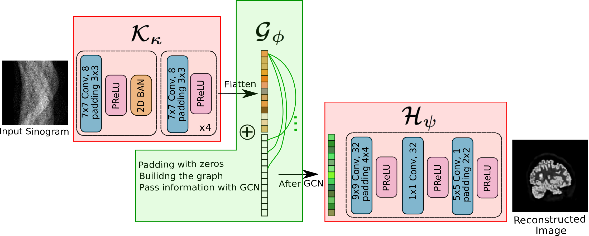

**Status: archived research code, not maintained**

# TomoGNN — Linking the Dots: Pixel-Detectors Associations for Improved PET Direct Image Reconstruction

Code for an unpublished manuscript that has been **withdrawn**. The repository is kept for reference only: no issues or pull requests will be handled, and nothing here should be read as a validated result. Please read the retrospective below before using or citing anything.



## Retrospective

The manuscript proposed a single graph-convolution layer $\mathcal{G}_\phi$ (its Eq. 5) to map a sinogram $y\in\mathbb{R}^n$ to the image domain, between a sinogram CNN $\mathcal{K}_\kappa$ and an image CNN $\mathcal{H}_\psi$, with a bipartite LOR–pixel graph defined by a binary adjacency matrix $A$:

$$\mathcal{G}_\phi(y)=\sigma\!\left(C_2\,D^{-1/2}AD^{-1/2}\,C_1\,y\,\varphi_1\varphi_2\right),\qquad \varphi_1\in\mathbb{R}^{1\times d},\ \varphi_2\in\mathbb{R}^{d\times 1}.$$

1. $\varphi_1\varphi_2=c\in\mathbb{R}$ is a scalar, so the $d$-dimensional embedding adds no expressive power: $y\varphi_1\varphi_2=c\,y$.
2. Writing $A=\begin{pmatrix}0&B\\B^\top&0\end{pmatrix}$ with $B\in\{0,1\}^{n\times m}$ the LOR–pixel incidence matrix, $C_1,C_2$ only pad and crop, hence $\mathcal{G}_\phi(y)=\mathrm{ReLU}\big(c\;D_p^{-1/2}B^\top D_\ell^{-1/2}\,y\big)$ with fixed diagonal degree normalizations $D_p, D_\ell$.
3. This is a degree-normalized binary backprojection $B^\top$ with one learnable scale $c$, followed by a ReLU. No graph-specific computation remains beyond what a backprojector already does.
4. $\mathcal{K}_\kappa$ is a 2-D convolutional network acting on the sinogram, so it can learn a ramp-type filter along the detector axis. The full model is then $\mathcal{H}_\psi\circ\mathrm{ReLU}\big(c\,B^\top_{\mathrm{norm}}\,\mathcal{K}_\kappa(y)\big)$, i.e. a learned-filter filtered backprojection followed by image-domain post-processing.
5. Replacing $\mathcal{G}_\phi$ by a standard FBP backprojection gave equivalent results, i.e. the graph formulation offered no advantage over FBP followed by CNNs, and the manuscript was withdrawn. That replacement experiment is not part of this repository.

### How the released code relates to Eq. 5

The code differs from the manuscript's Eq. 5 in details, but not in conclusion (checked numerically against the shipped weights):

- `GCNConv(8, 10)` is used, not a rank-1 $\varphi_1\varphi_2$: its weight is a full-rank $10\times 8$ channel-mixing matrix $W$ plus a bias (90 parameters). Because $W$ acts on the channel axis it commutes with backprojection, and the layer evaluates to exactly $\;D_p^{-1/2}A^\top(XW^\top)+b\;$ with $D_p=\mathrm{diag}(1+\sum_i A_{ij})$ (max abs error $\approx10^{-7}$ vs. PyTorch Geometric).
- $A$ is the ASTRA `strip` system matrix (6.3 M non-zeros, about 1.8 M distinct values), i.e. a weighted, not binary, adjacency.
- No activation follows `GCNConv`; the next layer is a convolution followed by PReLU, not an explicit ReLU.

## Layout

```
tomognn/            importable package
  models.py         TomoGNN, GradientDifferenceLoss (+ unused message-passing helpers)
  data.py           ASTRA sinogram simulation and the Dataset classes (from AstraSinogramDataLoader.py)
  utils.py          ASTRA graph construction, MLEM / FBP reference helpers
scripts/
  train.py          training CLI
  inference.py      inference / plotting CLI
notebooks/          TomoGNN_inference.ipynb (inference demo; stored outputs are from the original run)
weights/            paradigm2_weights_epoch_233.pth (plain state_dict, 219,723 parameters)
figures/            architecture.png
Images/             33 small PNGs (in a folder named BrainWeb) and one .npy PET slice, used as samples
TomoGNNArchi.pdf    vector export of the architecture figure
```

## Method (as described in the manuscript)

$F_\theta=\mathcal{H}_\psi\circ\mathcal{G}_\phi\circ\mathcal{K}_\kappa$: a sinogram-to-sinogram CNN, the single GCN layer above (nodes = sinogram bins + pixels, zero-padded features, edges from the ASTRA system matrix), and an image-to-image CNN. Training minimizes $\mathrm{MSE}+\mathrm{GDL}$ (gradient-difference loss) with Adam.

The manuscript reported results against FBP, MLEM and DeepPET on BrainWeb and XCAT phantoms (PSNR/SSIM, reduced-dose and out-of-distribution tests). **None of that evaluation is reproducible from this repository**: it contains no metric code, no MLEM/FBP/DeepPET comparison, no training data, and the manuscript's data splits are not included. Any comparative or "state-of-the-art" claim made in earlier versions of this README or in the manuscript should be considered superseded by the retrospective above.

### Where the code differs from the manuscript

| | Manuscript | This code |
|---|---|---|
| Graph layer | scalar $\varphi_1\varphi_2$, binary $A$, ReLU | full $8\to10$ `GCNConv` + bias, weighted ASTRA $A$, no activation (see above) |
| Sinogram CNN $\mathcal{K}_\kappa$ | 7×7 convs, 8 channels, batch-norm | 5 × 7×7 convs (`AndrewCNN`: 1→32→32→32→32→8), one BatchNorm |
| Image CNN $\mathcal{H}_\psi$ | 9×9 / 1×1 / 5×5 convs, 32/32/1 channels | `SRNET`: 10→64 (9×9), 64→32 (1×1), 32→1 (5×5), PReLU after each |
| Noise model | Poisson emission model with attenuation, ≈10⁶ counts, attenuation-corrected | transmission-style noise (`I0·exp(−p)`, Poisson, log) with `I0` = 1000 (500 in one dataset class) applied to ASTRA parallel-beam projections; no attenuation, scatter or randoms are modelled |
| Training | batch 25, 300 epochs, 5,000 training slices (17 BrainWeb volumes) | `train.py` defaults: batch 5, loop bound 20,000 epochs, 50 images; the shipped weights are named `epoch_233` |
| Augmentation | in supplementary material | random rotation (0–359°) and translation (±10 px) applied to every image, test images included |

## Installation

Tested only for import, compilation and short CPU runs (see below), with Python 3.11, torch 2.14, torch_geometric 2.8 and astra-toolbox 2.5 (the original work used Python 3.8).

```bash
pip install torch torchvision          # choose the build for your CUDA version
pip install -r requirements.txt        # see the ASTRA notes in this file
pip install -e .                       # makes `tomognn` importable from scripts/
```

## Usage

```bash
# one image, using the shipped weights and the sample slice (opens a matplotlib window)
python scripts/inference.py --single-image Images/PET_test_slice_452.npy

# random images from a folder of grayscale PNGs
python scripts/inference.py --test-dir Images/BrainWeb --num-img-test 33

# training (the dataset used in the manuscript is not included)
python scripts/train.py --train-dir path/to/train_pngs --test-dir path/to/test_pngs --output-dir outputs/run1
```

`python scripts/train.py --help` and `python scripts/inference.py --help` list all options. The plots show the simulated noisy sinogram, the ground truth, the reconstruction and their difference; reconstructions and ground truth are min–max normalized for display, and no quantitative metric is computed.

## Known issues (kept as found)

- `train.py` builds its training dataset with `mode='test'`, so it samples from `--test-dir`; `--train-dir` is listed but never sampled from.
- `models.MessagePassBackproject` refers to undefined globals (`num_pixels`, ...) and would raise `NameError` if called. It is not used anywhere.
- `inference.py` indexes the model output with `out[-num_pixels*num_pixels:]`, which only behaves correctly for batch size 1.
- `--num-img-test` (default 800, as in the original) must not exceed the number of images in `--test-dir`.
- `utils.Rec_FBP` needs ASTRA's CUDA algorithm `FBP_CUDA`; `utils.MLEM_reconstruct` and `Rec_FBP` are not called by any script.
- The only deliberate behavior change from the original scripts is `map_location=device` when loading weights, because the shipped checkpoint was saved from a GPU and otherwise cannot be loaded on CPU-only machines.

## Data and licence

The code is released under the [MIT License](LICENSE). The sample images in `Images/` appear to derive from third-party data sets (the folder is named `BrainWeb`) that are not covered by this licence; their provenance and terms are not documented here, so check the original sources before reuse.
